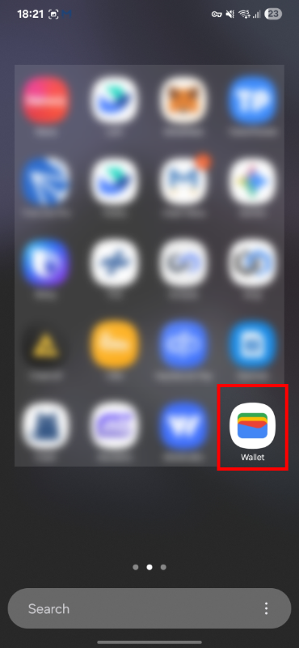
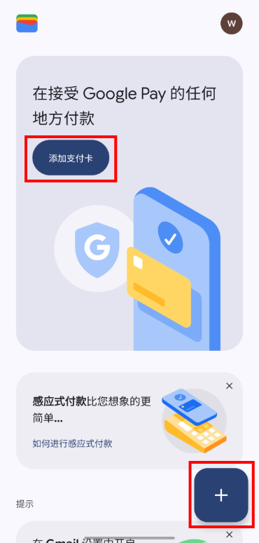
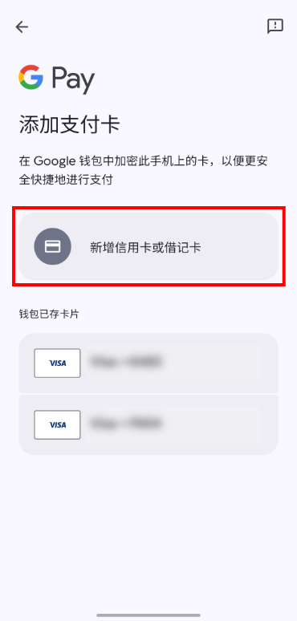
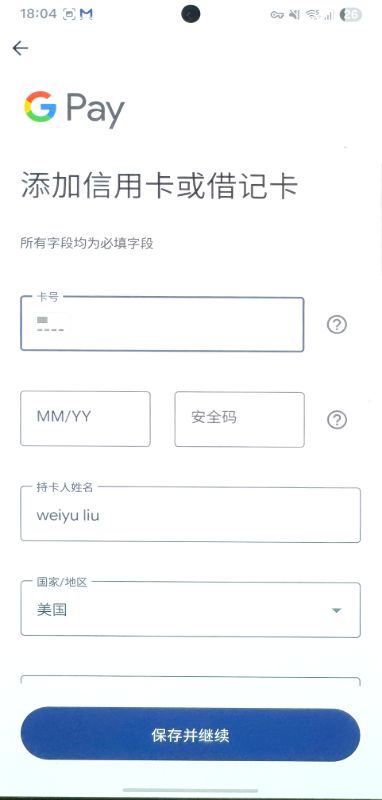
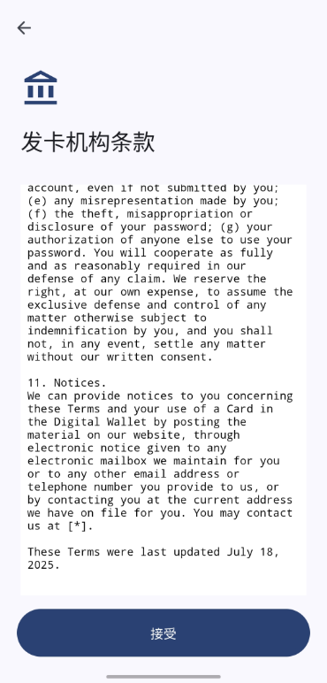
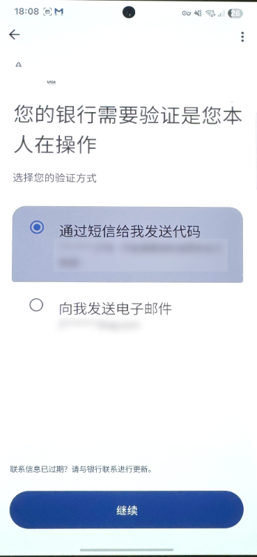
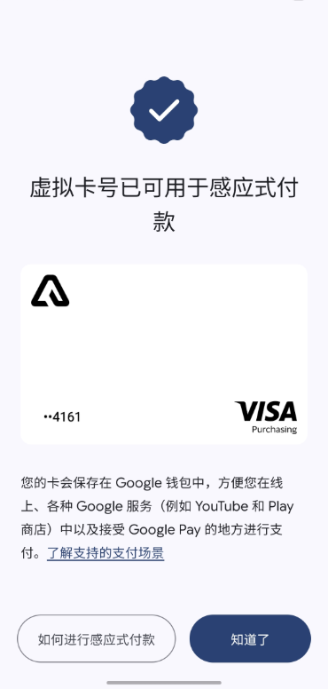

## 概述

**描述**: 安卓用户绑定Google Pay流程  
**目的**: 通过Google Pay实现线下NFC支付、线上App/网页支付、关联Google服务

---

## 详细操作步骤

### 步骤1：打开Google wallet应用

- **前置操作**:
  - 未安装：Google Play商店搜索「Google Wallet」下载安装
  - 首次打开：登录Google账户 → 点击「开始使用」
- **操作**: 打开已安装的Google Pay/Google Wallet应用

---

### 步骤2：添加支付卡

- **操作**: 点击首页「添加支付卡」或「+」图标

---

### 步骤3：输入卡片信息

- **操作**: 填写卡号、有效期、CVV、持卡人姓名

---

### 步骤4：同意条款

- **操作**: 阅读并接受发卡机构服务条款

---

### 步骤5：身份验证

- **操作**: 通过短信/邮件/App完成验证流程。

---
### 步骤6：绑定成功

- **提示信息**: 卡片成功添加至Google Pay
- **可用场景**:
  - 实体店线下NFC支付
  - App内和网页线上支付
  - 关联Google服务（YouTube Premium、Play商店等）

---

## 全局安全提醒

**提醒事项**:
1. 谨防诈骗：添加卡片时无需向第三方网站输入密码/验证码，防范钓鱼攻击
2. 设备安全：设置锁屏密码、指纹或人脸识别，防止未授权使用
3. 消费监控：通过PayFun App实时查看交易记录，确保明细透明

---

## 使用提示

### 准备工作
1. **账户准备**: 确保已登录有效的Google账户
2. **卡片信息**: 准备好PayFun虚拟卡或者实体卡的完整信息

### 支付使用方式
- **线下支付**: 解锁手机后靠近POS机NFC感应区
- **线上支付**: 在支持Google Pay的App或网站选择Google Pay支付
- **Google服务**: 可用于支付Google Play商店、YouTube Premium等服务

### 常见问题
#### Q: 为什么无法找到添加卡片的选项？
A: 请确保Google Pay应用已更新至最新版本，并检查设备是否支持NFC功能。

#### Q: 验证过程失败怎么办？
A: 检查网络连接，确保输入的验证码正确，或尝试更换验证方式（短信/邮件）。

#### Q: 绑定后卡片无法使用？
A: 确认PayFun卡片在App中已激活且有足够余额，同时检查设备NFC功能是否开启。

---