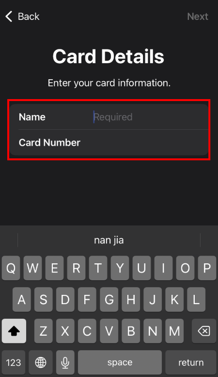
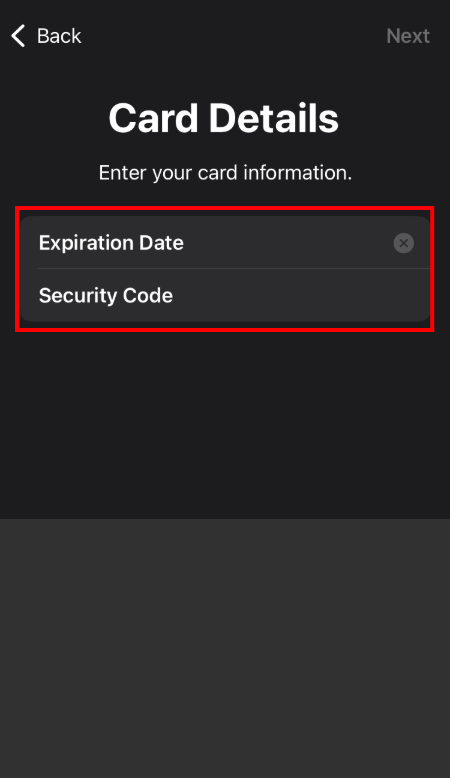

## Overview

**Description**: iPhone user binding process for Apple Wallet
**Purpose**: Enable offline NFC payments and online App/web payments via Apple Pay

---

## Detailed Operation Steps

### Step 1: Open the Apple Wallet App

- **Operation**: iPhone Home Screen → Tap the pre-installed **Wallet** app
- **Function Description**: Apple Wallet is the official digital wallet for managing payment card credentials

---

### Step 2: Select to Add a Card

- **Operation**: Choose the **Debit or Credit Card** option (auto-redirected for first-time addition)

---

### Step 3: Enter Card Information

- **Operation**: Tap **Enter Card Information Manually** → Fill in the card number, expiration date, and CVV

---

### Step 4: Agree to Terms and Complete Verification

- **Operation 1**: Read and accept the terms and conditions of the bank/payment service provider
- **Operation 2**: Complete verification (SMS verification code/email verification). Note: Priority is given to email verification; SMS verification may not be available in some regions.

---

### Step 5: Complete Binding

- **Result**: Card activation successful

---

## Usage Tips

1. **Preparation Materials**: Ensure you have obtained all information of your PayFun Virtual Card (card number, expiration date, CVV)
2. **Network Connection**: Maintain a stable network connection during the operation
3. **Account Status**: Ensure your PayFun account has completed KYC verification and the card has been activated

## Frequently Asked Questions

### Q: Why am I unable to add a card?
- A: Please check your network connection, card status, and whether you have completed KYC verification

### Q: What should I do if verification fails?
- A: Ensure the verification code entered is correct; if verification fails multiple times, try resending the verification code

### Q: How do I use the card after successful addition?
- A: For offline payments, double-click the side button to wake up Apple Pay; for online payments, select Apple Pay as the payment method
