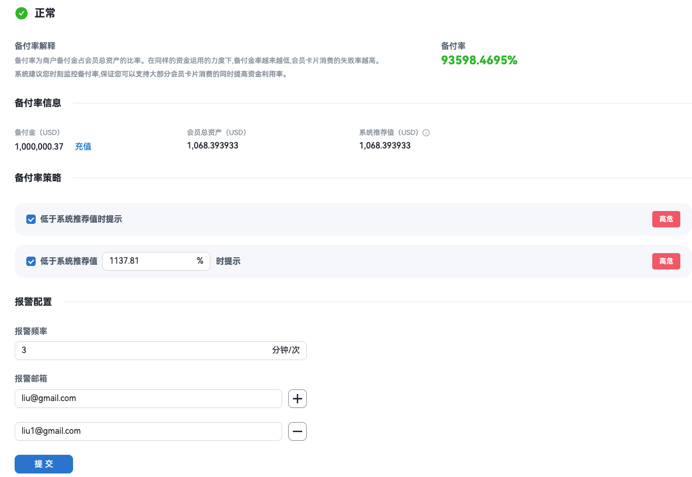

## I. Overview

Merchants with custody fund licenses can manage their own reserve fund and do not need the platform to manage it for them.

<Info>
**Terminology**
- **Reserve fund**: Funds used for cardholder spending, card issuance, and unified logistics payouts; managed by the merchant.
- **Reserve ratio**: Reserve fund ÷ total member assets; used to measure funding coverage and transaction success rate.
- **Total member assets**: Total value (USD) of digital assets held by members.
</Info>

---

## II. Operations

### 2.1 Reserve fund top-up

Ensure the reserve fund account has sufficient balance before cardholder spending; otherwise transactions will fail.

- **Method: External wallet address**

<Steps>
<Step title="Select deposit token">
On the top-up page, select a token (e.g. USDT); the deposit details for that token are then shown.
</Step>
<Step title="Fees and estimated amount">
- **Fee**: The fee for this deposit; the actual credited amount is the deposit amount minus the fee.
- **Estimated credited amount**: Deposit amount − fee; the final amount is calculated using the exchange rate.
</Step>
<Step title="Submit and get receive address">
After clicking **Submit**, the system shows the **receive address** for the selected token; the user sends funds from an external wallet to this address to complete the deposit.
</Step>
<Step title="Check result">
Click **View result** to go to the **Deposit records** page to see the status and credited amount; settlement may take some time.
</Step>
</Steps>

- **Method: MPC wallet (bound)** *(Coming soon)*

<Steps>
<Step title="Select deposit token">
On the top-up page, select a token (e.g. USDT); the deposit details for that token are then shown.
</Step>
<Step title="Confirm MPC balance">
Confirm that the MPC wallet has sufficient balance.
</Step>
<Step title="Fees and estimated amount">
- **Fee**: The fee for this deposit; the actual credited amount is the deposit amount minus the fee.
- **Estimated credited amount**: Deposit amount − fee; the final amount is calculated using the exchange rate.
</Step>
<Step title="Submit and authorize MPC transfer">
After authorization, the system initiates the deposit.
</Step>
<Step title="Check result">
Click **View result** to go to the **Deposit records** page to see the status and credited amount; settlement may take some time.
</Step>
</Steps>

### 2.2 Reserve fund withdrawal

<Steps>
<Step title="Initiate withdrawal and confirm address">
Enter withdrawal amount, receive address, etc., and click **Initiate withdrawal**.
</Step>
<Step title="Fees and estimated amount">
- **Fee**: The fee for this withdrawal; the actual received amount is the withdrawal amount minus the fee.
- **Estimated received amount**: Withdrawal amount − fee; the final amount is calculated using the exchange rate.
</Step>
<Step title="Platform review">
The withdrawal request goes to **Reserve fund withdrawal review**. After approval, the system executes the withdrawal.
</Step>
<Step title="Digital asset receive address">
If the MPC wallet address is available it is shown; otherwise the field is empty and the user can click **Change address** to enter a receive address.
</Step>
</Steps>

---

## III. Notes

<Warning>
- On-chain deposits are irreversible; confirm the **correct receive address** shown by the system before sending.
- Observe minimum deposit limits to avoid amounts too small to be credited.
- Keep the reserve fund sufficient; high transaction failure rates lead to extra fees per transaction.
</Warning>
